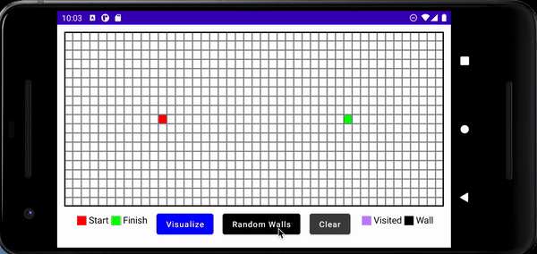

# Path Finding Visualizer App using Jetpack Compose

A simple path finding visualizer mobile app to demonstrate the use of Jetpack Compose UI toolkit in
Android.

The algorithm used is [Dijkstra's Algorithm](https://en.wikipedia.org/wiki/Dijkstra%27s_algorithm)

## Requirements

- Android Studio Arctic Fox 2020.3.1 beta 5 (or later)

## Technologies

- [Kotlin 1.5.10](https://kotlinlang.org/)
- [Compose UI](https://developer.android.com/jetpack/compose)
- [Kotlin Coroutines](https://developer.android.com/kotlin/coroutines)

## Features

- Visualize guaranteed shortest path using Dijkstra's algorithm
- Clear grid
- Prepopulate grid with randomized walls
- Manually add walls when cell is clicked

## Future Features (contributions are welcome!)

- Dark Mode
- Movable Start Cell and Finish Cell
- Other path finding algorithms support
- Improve animations and gestures
- Weighted walls

This pet project is inspired by Clement
Mihailescu's [Pathfinding Visualizer project](https://github.com/clementmihailescu/Pathfinding-Visualizer)